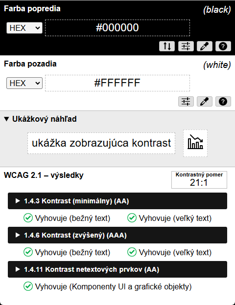

# Colour Contrast Analyser

> **Toto je slovenský preklad README** pre [tento neoficiálny fork](https://github.com/rraddatch/CCAe) nástroja [Colour Contrast Analyser od TPGi](https://github.com/ThePacielloGroup/CCAe). Ide o predvolený README tohto repozitára. Pôvodné anglické README nájdeš v [README.en.md](README.en.md).

Colour Contrast Analyser (CCA) pomáha zistiť čitateľnosť textu a kontrast vizuálnych prvkov, ako sú grafické ovládacie prvky a vizuálne indikátory.

Tento repozitár obsahuje zdrojový kód novších verzií Colour Contrast Analyser (CCA) pre Windows a macOS, postavených na [Electrone](https://electronjs.org/). Staršie, ne-Electronové verzie ("CCA Classic") nájdeš v repozitároch [CCA-Win](https://github.com/ThePacielloGroup/CCA-Win) a [CCA-OSX](https://github.com/ThePacielloGroup/CCA-OSX).

Ďalšie informácie nájdeš na [stránke TPGi o Colour Contrast Analyser](https://www.tpgi.com/color-contrast-checker/).

## Funkcie
- Indikátory súladu s WCAG 2.1
- Viacero spôsobov zadávania farieb: priamy textový vstup (akýkoľvek platný CSS formát farby), RGB posuvníky, výber farby (len Windows a macOS)
- Podpora alfa priehľadnosti pre farbu popredia
- Simulátor farbosleposti

## Slovenský preklad
Tento fork navyše obsahuje kompletný slovenský preklad používateľského rozhrania (vyberateľný v Predvoľbách → Jazyk) a opravu chyby, kvôli ktorej sa zmena jazyka bez reštartu aplikácie neprejavila mimo okna Predvoľby. Obe zmeny sú navrhnuté aj priamo do pôvodného projektu v [ThePacielloGroup/CCAe#387](https://github.com/ThePacielloGroup/CCAe/pull/387). Hotový inštalátor nájdeš v [Releases tohto forku](https://github.com/rraddatch/CCAe/releases).

## Známe problémy
- Pozri známe problémy v poslednom [vydaní CCA](https://github.com/ThePacielloGroup/CCAe/releases) a [potvrdené chyby](https://github.com/ThePacielloGroup/CCAe/issues?q=is%3Aissue+is%3Aopen+label%3Abug)

## Prispievanie
Ak máš nápad na novú funkciu alebo si našiel chybu, založ prosím issue na GitHube. Pred založením skontroluj, či podobné issue už neexistuje, aby sme predišli duplicitám.

Ak chceš prispieť, pošli prosím pull request a niekto skontroluje tvoj kód. Pred odoslaním pull requestu sa riaď [pravidlami prispievania](CONTRIBUTING.md).

## Kontakt
Ak máš akékoľvek otázky, neváhaj založiť issue tu na GitHube.

## Licencia

Colour Contrast Analyser (CCA) je slobodný softvér: môžeš ho používať, študovať, zdieľať a vylepšovať podľa vlastného uváženia. Konkrétne ho môžeš ďalej šíriť a/alebo upravovať za podmienok [GNU General Public License](https://www.gnu.org/licenses/gpl.html) tak, ako ju vydala Free Software Foundation, buď vo verzii 3 tejto licencie, alebo (podľa vlastnej voľby) v ktorejkoľvek neskoršej verzii.

> Tento program je šírený v nádeji, že bude užitočný, avšak BEZ AKEJKOĽVEK ZÁRUKY; dokonca aj bez predpokladanej záruky OBCHODOVATEĽNOSTI alebo VHODNOSTI NA KONKRÉTNY ÚČEL. Podrobnosti nájdeš v GNU General Public License.
